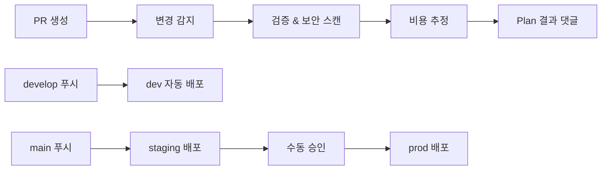

# StackKit - Terraform Infrastructure Framework

**개발자를 위한 5분 AWS 인프라 구축 솔루션** 🚀

표준화된 모듈과 자동화 스크립트로 복잡한 AWS 인프라를 간단하게 구축하고 관리하세요.

---

## ⚡ 5분 빠른 시작

### 📋 사전 요구사항

```bash
# 1. 필수 도구 설치
terraform --version  # >= 1.7.0
aws --version        # >= 2.0
jq --version         # JSON 처리용

# 2. AWS 자격증명 설정
aws configure

# 3. 권한 확인
aws sts get-caller-identity
```

### 🚀 즉시 배포하기

```bash
# 1️⃣ 스택 생성 (30초)
terraform/scripts/new-stack.sh my-web-app dev --template=webapp

# 2️⃣ 배포 (3-4분)  
terraform/scripts/deploy.sh my-web-app dev apply

# 3️⃣ 확인 (30초)
cd terraform/stacks/my-web-app/dev
terraform output
```

**🎉 완료!** 이제 VPC, EC2, RDS, Redis가 포함된 웹 애플리케이션 인프라가 준비되었습니다.

---

## 🏗️ 프로젝트 구조

```
stackkit/
├── terraform/
│   ├── modules/              # 재사용 가능한 11개 AWS 서비스 모듈
│   │   ├── vpc/             # 네트워킹 (VPC, Subnets, NAT, IGW)
│   │   ├── ec2/             # 컴퓨팅 (EC2, ASG, Security Groups)
│   │   ├── rds/             # 관계형 DB (MySQL, PostgreSQL, Multi-AZ)
│   │   ├── elasticache/     # 캐싱 (Redis, Memcached, 클러스터)
│   │   ├── dynamodb/        # NoSQL DB (테이블, GSI, Auto Scaling)
│   │   ├── lambda/          # 서버리스 (함수, 트리거, VPC 연결)
│   │   ├── sqs/             # 메시지 큐 (표준/FIFO, DLQ, 배치)
│   │   ├── sns/             # 알림 서비스 (토픽, 구독, 필터)
│   │   ├── eventbridge/     # 이벤트 버스 (규칙, 타겟, 아카이브)
│   │   ├── kms/             # 암호화 키 (키 관리, 정책, 로테이션)
│   │   └── ...              # 확장 가능한 모듈 구조
│   │
│   ├── stacks/              # 실제 배포 단위 (Stack-centric)
│   │   └── <stack-name>/
│   │       ├── dev/         # 개발 환경
│   │       ├── staging/     # 스테이징 환경
│   │       └── prod/        # 운영 환경
│   │
│   ├── scripts/             # 자동화 도구
│   │   ├── new-stack.sh     # 🆕 스택 생성 (템플릿 선택)
│   │   ├── validate.sh      # ✅ 검증 + 비용 추정
│   │   ├── deploy.sh        # 🚀 배포 자동화
│   │   ├── destroy.sh       # 💀 안전한 제거
│   │   └── tf_forbidden.sh  # 🛡️  정책 검증
│   │
│   └── templates/           # 스택 템플릿
│       └── stack-skeleton/  # 기본 스택 구조
└── .github/workflows/       # CI/CD 자동화
```

---

## 🎯 스택 템플릿 가이드

### 🌐 웹 애플리케이션 (`webapp`)
**포함 서비스**: VPC + EC2 + RDS + ElastiCache  
**용도**: 전통적인 3-tier 웹 애플리케이션  
**예상 비용**: ~$50-100/월 (dev), ~$200-300/월 (prod)

```bash
# 웹 애플리케이션 스택 생성
terraform/scripts/new-stack.sh my-website prod --template=webapp --region=ap-northeast-2
```

### 🔧 API 서버 (`api-server`) 
**포함 서비스**: VPC + Lambda + DynamoDB + SQS  
**용도**: 서버리스 API 백엔드  
**예상 비용**: ~$10-20/월 (dev), ~$50-100/월 (prod)

```bash
# API 서버 스택 생성
terraform/scripts/new-stack.sh my-api prod --template=api-server
```

### 📊 데이터 파이프라인 (`data-pipeline`)
**포함 서비스**: Lambda + SNS + SQS + EventBridge  
**용도**: 이벤트 기반 데이터 처리  
**예상 비용**: ~$5-15/월 (dev), ~$20-50/월 (prod)

```bash
# 데이터 파이프라인 스택 생성
terraform/scripts/new-stack.sh my-etl prod --template=data-pipeline
```

### 🛠️ 커스텀 (`custom`)
**포함 서비스**: 사용자 정의  
**용도**: 특별한 요구사항이 있는 프로젝트

```bash
# 커스텀 스택 생성
terraform/scripts/new-stack.sh my-special prod --template=custom
```

---

## 🔧 자동화 스크립트 상세 가이드

### `new-stack.sh` - 지능형 스택 생성기

```bash
# 기본 사용법
terraform/scripts/new-stack.sh <stack_name> <env> [OPTIONS]

# 옵션
--template=TYPE     # webapp|api-server|data-pipeline|custom
--region=REGION     # AWS 리전 (기본: ap-northeast-2)  
--bucket=BUCKET     # tfstate 버킷 (기본: stackkit-tfstate)
--table=TABLE       # DynamoDB 락 테이블 (기본: stackkit-tf-lock)

# 예시
terraform/scripts/new-stack.sh my-app dev --template=webapp --region=us-west-2
terraform/scripts/new-stack.sh my-api staging --template=api-server
```

**생성되는 파일들**:
- `versions.tf` - Terraform & Provider 버전
- `backend.tf` & `backend.hcl` - S3 상태 관리 설정  
- `variables.tf` - 입력 변수 정의
- `main.tf` - 모듈 연결 (템플릿별 최적화)
- `outputs.tf` - 출력 값 정의
- `terraform.tfvars` - 환경별 변수 값

### `validate.sh` - 종합 검증 도구

```bash
# 전체 검증 (권장)
terraform/scripts/validate.sh my-app dev

# 비용 추정만
terraform/scripts/validate.sh my-app dev --cost-only

# 검증만 (비용 제외)
terraform/scripts/validate.sh my-app dev --validate-only

# 상세 출력
terraform/scripts/validate.sh my-app dev --detailed

# JSON 형식
terraform/scripts/validate.sh my-app dev --format=json
```

**검증 항목**:
- ✅ Terraform 문법 및 구성 검증
- ✅ 포맷팅 검사
- ✅ 정책 준수 검증 (tf_forbidden.sh)
- ✅ 보안 스캔 (tfsec 연동)
- ✅ 비용 추정 (Infracost 연동)

### `deploy.sh` - 안전한 배포 자동화

```bash
# 플랜 확인
terraform/scripts/deploy.sh my-app dev plan

# 대화형 배포
terraform/scripts/deploy.sh my-app dev apply

# 자동 승인 (dev/staging 권장)
terraform/scripts/deploy.sh my-app dev apply --auto-approve

# 백업과 함께 배포 (prod 권장)
terraform/scripts/deploy.sh my-app prod apply --backup-state

# 특정 리소스만
terraform/scripts/deploy.sh my-app dev apply --target=module.database

# 롤백
terraform/scripts/deploy.sh my-app prod apply --rollback
```

**안전 장치**:
- 🛡️ Production 환경 특별 보호
- 💾 자동 상태 백업
- 🔍 AWS 자격증명 검증
- ⚠️ 정책 위반 사전 차단

### `destroy.sh` - 안전한 인프라 제거

```bash
# 미리보기 (실행 안함)
terraform/scripts/destroy.sh my-app dev --preview

# 리소스 목록 확인
terraform/scripts/destroy.sh my-app dev --list-resources

# 안전한 제거
terraform/scripts/destroy.sh my-app dev --backup-state

# 특정 리소스만
terraform/scripts/destroy.sh my-app dev --target=module.cache

# Production은 --force 필수
terraform/scripts/destroy.sh my-app prod --backup-state --force
```

**보호 기능**:
- 🛡️ 보호 리소스 자동 감지 (S3, KMS, Backup 등)
- ⚠️ Production 다단계 확인
- 💾 제거 전 상태 백업
- 📊 제거될 리소스 상세 분석

---

## 🏛️ 아키텍처 원칙

### Stack-centric 구조
- **모듈**: 재사용 가능한 부품 (`modules/`)
- **스택**: 실제 배포 단위 (`stacks/<name>/<env>/`)
- **환경 분리**: 디렉토리 기반 (`dev|staging|prod`)

### 상태 관리 표준
- **백엔드**: S3 + DynamoDB Lock
- **암호화**: KMS 암호화 활성화
- **버전관리**: S3 버전닝 필수
- **격리**: 스택별 독립적 상태 파일

### 명명 규칙
```
리소스명: {project}-{environment}-{service}-{purpose}
예시: stackkit-prod-rds-main, stackkit-dev-lambda-processor
```

### 필수 태그 정책
```hcl
default_tags = {
  Project     = "stackkit"
  Environment = var.environment
  Stack       = var.stack_name  
  Owner       = "platform"
  ManagedBy   = "terraform"
}
```

---

## 🔄 CI/CD 워크플로우

### 자동화된 파이프라인



### 환경별 배포 전략
- **dev**: 자동 배포 (`develop` 브랜치)
- **staging**: 자동 배포 (`main` 브랜치)  
- **prod**: 수동 승인 후 배포 (`main` 브랜치)

### 지능형 변경 감지
- 스택별 변경사항 자동 탐지
- 매트릭스 전략으로 병렬 처리
- 모듈 변경시 영향받는 스택만 검증

---

## 📚 모듈 상세 가이드

### 핵심 인프라 모듈

#### 🌐 VPC 모듈 (`modules/vpc/`)
```hcl
module "vpc" {
  source = "../../modules/vpc"
  
  project_name = "stackkit"
  environment  = var.environment
  vpc_cidr     = "10.0.0.0/16"
  
  # Multi-AZ 구성
  availability_zones = ["ap-northeast-2a", "ap-northeast-2c"]
  
  # 서브넷 설정
  public_subnet_cidrs  = ["10.0.1.0/24", "10.0.2.0/24"]
  private_subnet_cidrs = ["10.0.10.0/24", "10.0.20.0/24"]
  
  # NAT Gateway 설정
  enable_nat_gateway = true
  single_nat_gateway = var.environment == "dev"
  
  common_tags = local.common_tags
}
```

#### 💻 EC2 모듈 (`modules/ec2/`)
```hcl
module "web_server" {
  source = "../../modules/ec2"
  
  project_name   = "stackkit"
  environment    = var.environment
  instance_type  = var.environment == "prod" ? "t3.medium" : "t3.micro"
  
  # AMI 자동 선택
  ami_id = data.aws_ami.amazon_linux.id
  
  # 네트워킹
  vpc_id    = module.vpc.vpc_id
  subnet_id = module.vpc.public_subnet_ids[0]
  
  # 보안
  security_group_rules = [
    { type = "ingress", from_port = 80, to_port = 80, protocol = "tcp", cidr_blocks = ["0.0.0.0/0"] },
    { type = "ingress", from_port = 443, to_port = 443, protocol = "tcp", cidr_blocks = ["0.0.0.0/0"] }
  ]
  
  # Auto Scaling
  min_size         = var.environment == "prod" ? 2 : 1
  max_size         = var.environment == "prod" ? 10 : 3
  desired_capacity = var.environment == "prod" ? 2 : 1
  
  common_tags = local.common_tags
}
```

#### 🗄️ RDS 모듈 (`modules/rds/`)
```hcl
module "database" {
  source = "../../modules/rds"
  
  project_name     = "stackkit"
  environment      = var.environment
  engine           = "mysql"
  engine_version   = "8.0"
  instance_class   = var.environment == "prod" ? "db.t3.small" : "db.t3.micro"
  allocated_storage = var.environment == "prod" ? 100 : 20
  
  # 가용성
  multi_az = var.environment == "prod"
  
  # 백업
  backup_retention_period = var.environment == "prod" ? 7 : 1
  backup_window          = "03:00-04:00"
  maintenance_window     = "sun:04:00-sun:05:00"
  
  # 보안
  vpc_id     = module.vpc.vpc_id
  subnet_ids = module.vpc.private_subnet_ids
  
  # 모니터링
  monitoring_interval = var.environment == "prod" ? 60 : 0
  
  common_tags = local.common_tags
}
```

### 데이터 저장소 모듈

#### 📊 DynamoDB 모듈 (`modules/dynamodb/`)
```hcl
module "user_table" {
  source = "../../modules/dynamodb"
  
  project_name = "stackkit"
  environment  = var.environment
  table_name   = "users"
  
  # 키 구성
  hash_key  = "user_id"
  range_key = "created_at"
  
  # 속성
  attributes = [
    { name = "user_id", type = "S" },
    { name = "created_at", type = "S" },
    { name = "email", type = "S" },
    { name = "status", type = "S" }
  ]
  
  # GSI
  global_secondary_indexes = [
    {
      name     = "email-index"
      hash_key = "email"
      projection_type = "ALL"
    },
    {
      name     = "status-index" 
      hash_key = "status"
      range_key = "created_at"
      projection_type = "KEYS_ONLY"
    }
  ]
  
  # 과금 모드
  billing_mode = var.environment == "prod" ? "PROVISIONED" : "PAY_PER_REQUEST"
  
  # Auto Scaling (prod만)
  read_capacity  = var.environment == "prod" ? 5 : null
  write_capacity = var.environment == "prod" ? 5 : null
  
  common_tags = local.common_tags
}
```

#### ⚡ ElastiCache 모듈 (`modules/elasticache/`)
```hcl
module "redis_cache" {
  source = "../../modules/elasticache"
  
  project_name   = "stackkit"
  environment    = var.environment
  engine         = "redis"
  engine_version = "7.0"
  
  # 노드 설정
  node_type      = var.environment == "prod" ? "cache.t3.micro" : "cache.t2.micro"
  num_cache_nodes = var.environment == "prod" ? 2 : 1
  
  # 클러스터 모드 (prod만)
  cluster_mode_enabled = var.environment == "prod"
  
  # 네트워킹
  vpc_id     = module.vpc.vpc_id
  subnet_ids = module.vpc.private_subnet_ids
  
  # 보안
  at_rest_encryption_enabled = true
  transit_encryption_enabled = var.environment == "prod"
  
  # 백업
  snapshot_retention_limit = var.environment == "prod" ? 7 : 1
  snapshot_window         = "03:00-05:00"
  
  common_tags = local.common_tags
}
```

### 서버리스 및 이벤트 처리

#### ⚡ Lambda 모듈 (`modules/lambda/`)
```hcl
module "api_handler" {
  source = "../../modules/lambda"
  
  project_name  = "stackkit"
  environment   = var.environment
  function_name = "api-handler"
  
  # 런타임 설정
  runtime = "python3.11"
  handler = "app.lambda_handler"
  filename = "api-handler.zip"
  
  # 성능 설정
  memory_size = var.environment == "prod" ? 512 : 128
  timeout     = var.environment == "prod" ? 30 : 15
  
  # VPC 연결 (필요시)
  vpc_config = {
    subnet_ids         = module.vpc.private_subnet_ids
    security_group_ids = [aws_security_group.lambda.id]
  }
  
  # 환경 변수
  environment_variables = {
    ENV = var.environment
    DB_ENDPOINT = module.database.endpoint
    CACHE_ENDPOINT = module.redis_cache.endpoint
  }
  
  # 트리거
  event_source_mapping = [
    {
      event_source_arn = module.queue.arn
      batch_size      = 10
      starting_position = "LATEST"
    }
  ]
  
  common_tags = local.common_tags
}
```

#### 📨 SQS 모듈 (`modules/sqs/`)
```hcl
module "task_queue" {
  source = "../../modules/sqs"
  
  project_name = "stackkit"
  environment  = var.environment
  queue_name   = "task-processing"
  
  # 큐 설정
  visibility_timeout_seconds = 300
  message_retention_seconds  = 1209600  # 14일
  
  # FIFO 큐 (필요시)
  fifo_queue = false
  
  # DLQ 설정
  create_dlq = true
  max_receive_count = 3
  
  # 배치 설정
  receive_wait_time_seconds = 20  # Long polling
  
  # Lambda 트리거 권한
  lambda_triggers = [
    {
      function_name = module.api_handler.function_name
      batch_size   = 10
    }
  ]
  
  common_tags = local.common_tags
}
```

### 보안 및 암호화

#### 🔐 KMS 모듈 (`modules/kms/`)
```hcl
module "app_encryption_key" {
  source = "../../modules/kms"
  
  project_name = "stackkit"
  environment  = var.environment
  key_name     = "app-data-encryption"
  description  = "Application data encryption key"
  
  # 키 정책
  key_usage = "ENCRYPT_DECRYPT"
  key_spec  = "SYMMETRIC_DEFAULT"
  
  # 로테이션
  enable_key_rotation = var.environment == "prod"
  
  # 사용자/역할 권한
  key_administrators = [
    "arn:aws:iam::${data.aws_caller_identity.current.account_id}:root"
  ]
  
  key_users = [
    module.api_handler.execution_role_arn,
    module.database.instance_role_arn
  ]
  
  # 서비스 통합
  key_service_roles_for_autoscaling = [
    "arn:aws:iam::${data.aws_caller_identity.current.account_id}:role/aws-service-role/autoscaling.amazonaws.com/AWSServiceRoleForAutoScaling"
  ]
  
  common_tags = local.common_tags
}
```

---

## 🔗 모듈 조합 패턴

### 💼 비즈니스 애플리케이션 스택
```hcl
# 1. 네트워킹 기반
module "vpc" { source = "../../modules/vpc" }

# 2. 컴퓨팅 계층  
module "web_servers" { source = "../../modules/ec2" }
module "api_functions" { source = "../../modules/lambda" }

# 3. 데이터 계층
module "main_database" { source = "../../modules/rds" }
module "cache_layer" { source = "../../modules/elasticache" }
module "document_store" { source = "../../modules/dynamodb" }

# 4. 메시징 계층
module "task_queue" { source = "../../modules/sqs" }
module "notifications" { source = "../../modules/sns" }

# 5. 보안 계층
module "encryption_key" { source = "../../modules/kms" }
```

### 📊 데이터 처리 파이프라인
```hcl
# 1. 이벤트 수집
module "event_bus" { source = "../../modules/eventbridge" }
module "ingestion_queue" { source = "../../modules/sqs" }

# 2. 데이터 처리
module "processor_functions" { source = "../../modules/lambda" }
module "batch_processing" { source = "../../modules/ec2" }

# 3. 데이터 저장
module "raw_data_store" { source = "../../modules/dynamodb" }
module "processed_data_db" { source = "../../modules/rds" }

# 4. 알림 및 모니터링
module "processing_alerts" { source = "../../modules/sns" }
```

---

## 🛡️ 보안 및 모범 사례

### 🔒 보안 가이드라인

#### 인증 및 권한
- **AWS OIDC 연동**: Access Key 없는 CI/CD
- **최소 권한 원칙**: 필요한 권한만 부여
- **역할 기반 접근**: IAM 역할 활용
- **교차 계정 접근**: Cross-account 역할 사용

#### 데이터 보안
- **전송 중 암호화**: TLS/SSL 필수
- **저장 중 암호화**: KMS 키 활용  
- **백업 암호화**: 스냅샷/백업 암호화
- **로그 보안**: CloudTrail, VPC Flow Logs

#### 네트워크 보안
- **VPC 격리**: 환경별 VPC 분리
- **보안 그룹**: 최소한의 포트/프로토콜만 허용
- **NACLs**: 추가 네트워크 계층 보호
- **WAF**: 웹 애플리케이션 방화벽 적용

### 📊 비용 최적화

#### 리소스 최적화
```hcl
# 환경별 리소스 크기 조정
instance_type = var.environment == "prod" ? "t3.large" : "t3.micro"
min_size     = var.environment == "prod" ? 2 : 1
max_size     = var.environment == "prod" ? 10 : 2

# 예약 인스턴스 활용 (prod)
reserved_instances = var.environment == "prod"

# Spot 인스턴스 활용 (개발/테스트)
spot_price = var.environment != "prod" ? "0.05" : null
```

#### 비용 모니터링
- **AWS Cost Explorer**: 비용 분석 및 예측
- **Budget 알람**: 예산 초과 시 알림
- **태그 기반 비용 추적**: 프로젝트/팀별 비용 분석
- **리소스 정리**: 사용하지 않는 리소스 자동 감지

### ⚡ 성능 최적화

#### Auto Scaling
```hcl
# CPU 기반 스케일링
scaling_policies = [
  {
    name          = "cpu-scale-up"
    adjustment_type = "ChangeInCapacity"
    scaling_adjustment = 1
    cooldown      = 300
    metric_name   = "CPUUtilization"
    threshold     = 70
    comparison_operator = "GreaterThanThreshold"
  }
]
```

#### 캐싱 전략
- **ElastiCache**: 세션, 자주 액세스하는 데이터
- **CloudFront**: 정적 콘텐츠, API 캐싱
- **Application-level**: 애플리케이션 내 캐싱

---

## 🔄 운영 및 모니터링

### 📈 모니터링 설정

#### CloudWatch 대시보드
```hcl
# 커스텀 대시보드 생성
resource "aws_cloudwatch_dashboard" "main" {
  dashboard_name = "${var.project_name}-${var.environment}-dashboard"
  
  dashboard_body = jsonencode({
    widgets = [
      {
        type   = "metric"
        properties = {
          metrics = [
            ["AWS/EC2", "CPUUtilization", "InstanceId", module.web_server.instance_id],
            ["AWS/RDS", "CPUUtilization", "DBInstanceIdentifier", module.database.instance_id],
            ["AWS/Lambda", "Duration", "FunctionName", module.api_handler.function_name]
          ]
          period = 300
          stat   = "Average"
          region = var.region
          title  = "Resource Utilization"
        }
      }
    ]
  })
}
```

#### 알람 설정
```hcl
# CPU 사용률 알람
resource "aws_cloudwatch_metric_alarm" "high_cpu" {
  alarm_name          = "${var.project_name}-${var.environment}-high-cpu"
  comparison_operator = "GreaterThanThreshold"
  evaluation_periods  = "2"
  metric_name         = "CPUUtilization"
  namespace           = "AWS/EC2"
  period              = "300"
  statistic           = "Average"
  threshold           = "80"
  alarm_description   = "This metric monitors ec2 cpu utilization"
  
  dimensions = {
    InstanceId = module.web_server.instance_id
  }
  
  alarm_actions = [module.notifications.topic_arn]
}
```

### 🔄 백업 및 재해 복구

#### 자동 백업 정책
```hcl
# RDS 백업
backup_retention_period = var.environment == "prod" ? 7 : 1
backup_window          = "03:00-04:00"
copy_tags_to_snapshot  = true

# DynamoDB 백업
point_in_time_recovery_enabled = var.environment == "prod"

# EC2 스냅샷
resource "aws_dlm_lifecycle_policy" "ec2_snapshots" {
  description        = "EC2 snapshot lifecycle policy"
  execution_role_arn = aws_iam_role.dlm_lifecycle.arn
  state             = "ENABLED"
  
  policy_details {
    resource_types   = ["VOLUME"]
    target_tags = {
      Environment = var.environment
    }
    
    schedule {
      name = "daily-snapshots"
      
      create_rule {
        interval      = 24
        interval_unit = "HOURS"
        times         = ["03:00"]
      }
      
      retain_rule {
        count = var.environment == "prod" ? 7 : 3
      }
    }
  }
}
```

---

## 🚨 문제 해결 가이드

### 일반적인 오류 및 해결책

#### 1. AWS 자격증명 오류
```bash
# 현재 자격증명 확인
aws sts get-caller-identity

# 프로필 설정 확인  
aws configure list

# 새 프로필 설정
aws configure --profile stackkit
```

#### 2. Terraform 상태 잠금 오류
```bash
# 잠금 상태 확인
terraform force-unlock <LOCK_ID>

# 상태 파일 새로고침
terraform refresh

# 상태 파일 복구
terraform state pull > backup.tfstate
```

#### 3. 모듈 초기화 오류
```bash
# 모듈 캐시 정리
rm -rf .terraform

# 재초기화
terraform init -upgrade

# 특정 모듈만 재다운로드
terraform get -update
```

#### 4. 계획 생성 오류
```bash
# 상세 로그와 함께 실행
TF_LOG=DEBUG terraform plan

# 특정 리소스만 계획
terraform plan -target=module.vpc

# 변수 파일 지정
terraform plan -var-file=dev.tfvars
```

#### 5. 적용 실패 시 복구
```bash
# 백업에서 복구
terraform/scripts/deploy.sh my-app dev apply --rollback

# 특정 리소스 재생성
terraform apply -replace=module.database.aws_db_instance.this

# 드리프트된 리소스 가져오기
terraform import module.vpc.aws_vpc.main vpc-12345678
```

### 🔍 디버깅 도구

#### Terraform 로깅
```bash
# 환경 변수로 로그 레벨 설정
export TF_LOG=DEBUG
export TF_LOG_PATH=./terraform.log

# 실행
terraform plan
terraform apply
```

#### AWS CLI 디버깅
```bash
# AWS CLI 디버그 모드
aws --debug sts get-caller-identity

# 특정 서비스 상태 확인
aws ec2 describe-instances
aws rds describe-db-instances
aws lambda list-functions
```

---

## 📞 지원 및 참고 자료

### 📚 추가 문서
- **Quick Start**: `/terraform/QUICK_START.md` 
- **모듈 문서**: 각 모듈의 `README.md` 참조
- **예제 프로젝트**: `/terraform/templates/` 디렉토리

### 🔗 외부 참고 자료
- [Terraform 공식 문서](https://terraform.io/docs)
- [AWS Provider 문서](https://registry.terraform.io/providers/hashicorp/aws/latest/docs)
- [AWS Well-Architected Framework](https://aws.amazon.com/architecture/well-architected/)
- [Terraform Best Practices](https://www.terraform-best-practices.com/)

### 🐛 이슈 리포팅
- **GitHub Issues**: 버그 리포트 및 기능 요청
- **팀 채널**: `#infrastructure-support`
- **문서 기여**: Pull Request 환영

### 🏷️ 버전 및 라이선스
- **현재 버전**: v2.0.0 (Stack-centric Architecture)
- **Terraform 버전**: >= 1.7.0
- **AWS Provider**: ~> 5.100
- **라이선스**: MIT License

---

## 🎉 시작하기

준비되셨나요? 지금 바로 첫 번째 스택을 생성해보세요!

```bash
# 1. 웹 애플리케이션 스택 생성
terraform/scripts/new-stack.sh my-first-app dev --template=webapp

# 2. 검증
terraform/scripts/validate.sh my-first-app dev

# 3. 배포  
terraform/scripts/deploy.sh my-first-app dev apply

# 4. 확인
cd terraform/stacks/my-first-app/dev
terraform output
```

**축하합니다! 🎊** 이제 StackKit을 사용하여 전문적인 AWS 인프라를 관리할 수 있습니다.

---

*"Infrastructure as Code, simplified and standardized for everyone."* - StackKit Team